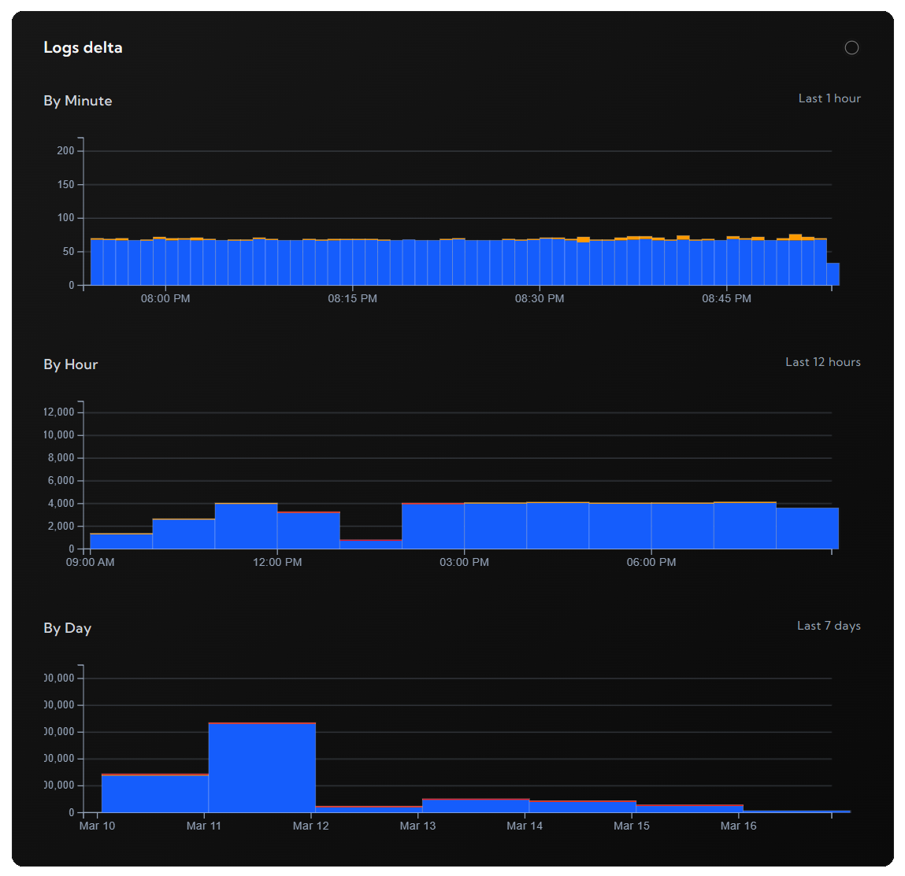

# logdash - Ruby SDK

Logdash is a zero-config observability platform. This package serves as a Ruby interface to use it.

## Pre-requisites

Setup your free project in less than 2 minutes at [logdash.io](https://logdash.io/)

## Installation

Add this line to your application's Gemfile:

```ruby
gem 'logdash'
```

And then execute:

```bash
bundle install
```

Or install it yourself as:

```bash
gem install logdash
```

## Logging

```ruby
require 'logdash'

logdash_client = Logdash.create(api_key: "YOUR_API_KEY")
logger = logdash_client[:logger]

logger.info('Application started successfully')
logger.error('An unexpected error occurred')
logger.warn('Low disk space warning')
logger.debug('Debugging information')
logger.verbose('Verbose logging')
logger.http('HTTP request details')
logger.silly('Silly level logging')
```

## Metrics

```ruby
require 'logdash'

logdash_client = Logdash.create(api_key: "YOUR_API_KEY")
metrics = $logdash_client[:metrics]

metrics.set('users', 0)
metrics.mutate('users', 1)
```

## Ruby on Rails

In a Ruby on Rails application, you can use an initializer to configure Logdash. Create a new file in `config/initializers/logdash.rb` with the following content:

```ruby
require 'logdash'

ActiveSupport.on_load(:after_initialize) do
  $logdash_client = Logdash.create(api_key: "YOUR_API_KEY")
  $logger = $logdash_client[:logger]
  $metrics = $logdash_client[:metrics]
end
```

This will make `$logger` and `$metrics` available throughout your Ruby on Rails application.

## Configuration

| Parameter | Required | Default | Description                                                                                                              |
| --------- | -------- | ------- | ------------------------------------------------------------------------------------------------------------------------ |
| `api_key` | no       | -       | Api key used to authorize against logdash servers. If you don't provide one, logs will be logged into local console only |
| `host`    | no       | `https://api.logdash.io` | Custom API host, useful with self-hosted instances                                                                       |
| `verbose` | no       | `false` | Useful for debugging purposes                                                                                            |

## View

To see the logs or metrics, go to your project dashboard




## License

This project is licensed under the MIT License. See `LICENSE` for more information.

## Contributing

Contributions are welcome! Feel free to open issues or submit pull requests.

### Running Tests

Before submitting a PR, please run the test suite and rubocop:

```bash
bundle exec rspec
bundle exec rubocop
```

## Support

If you encounter any issues, please open an issue on GitHub or let us know at [contact@logdash.io](mailto:contact@logdash.io).
